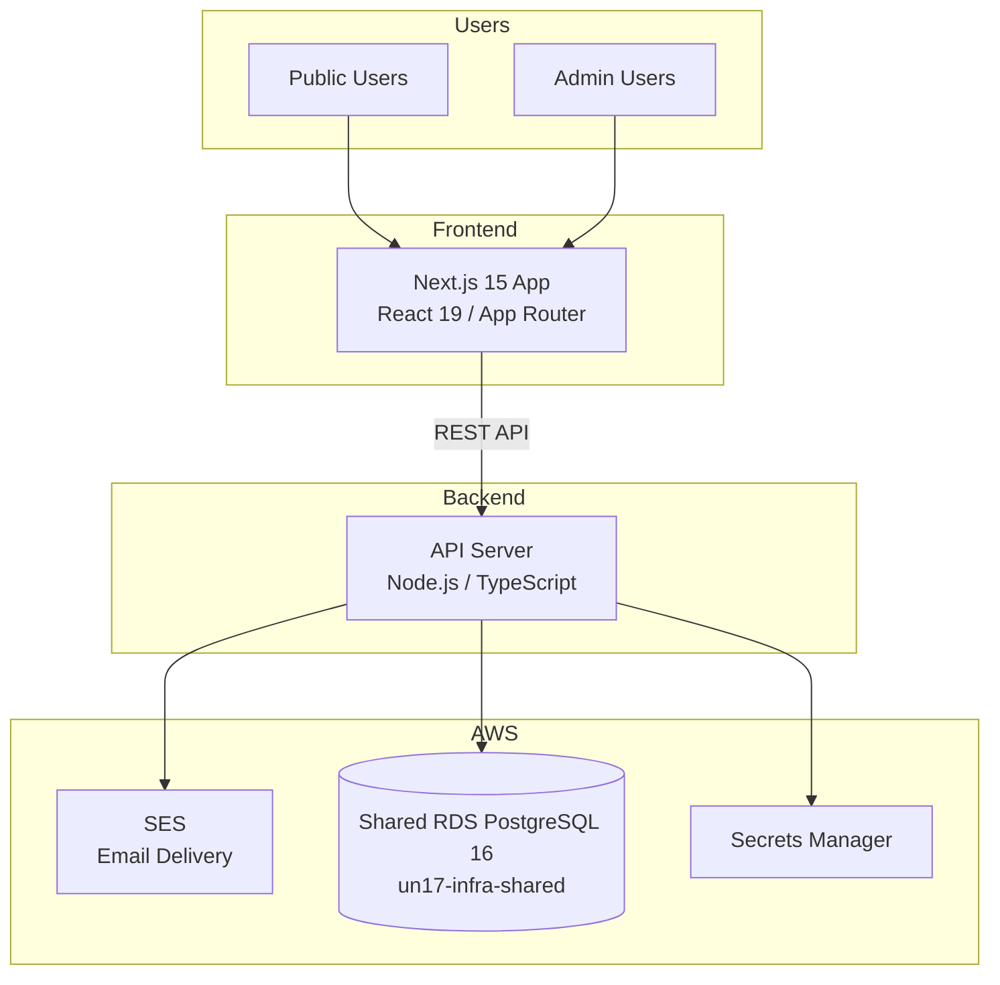
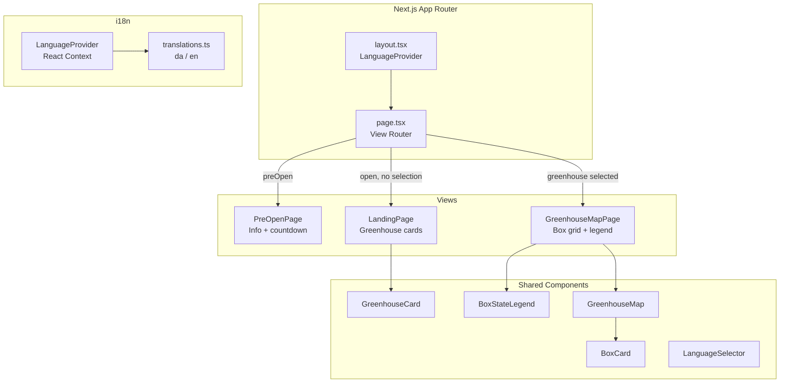
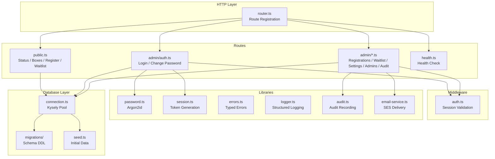
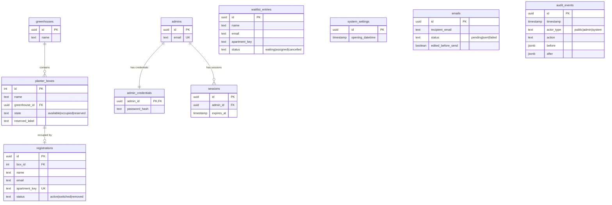
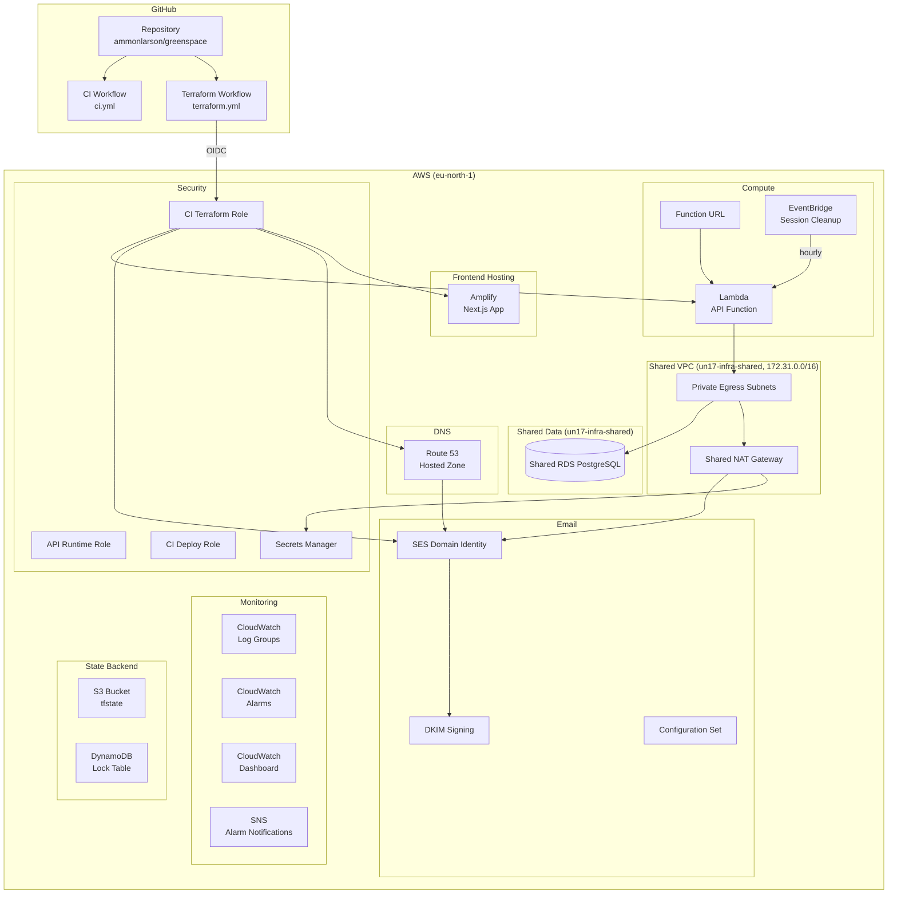
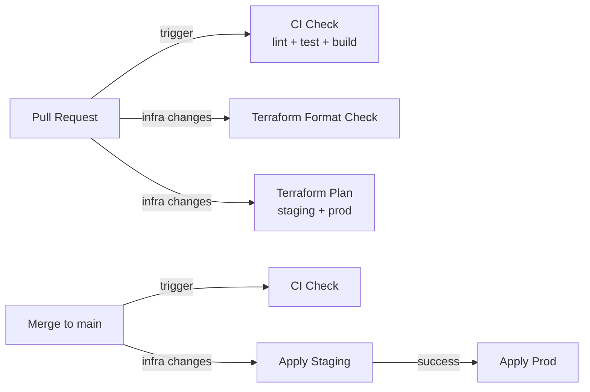

# UN17 Village Rooftop Gardens Architecture

## System Overview

UN17 Village Rooftop Gardens is a bilingual (Danish/English) registration platform that allows UN17 Village residents to register for rooftop planter boxes across two greenhouses. The system serves public users (no authentication) and admin users (email/password authentication).



## Frontend Architecture

The frontend is a Next.js 15 application using the App Router with React 19. It uses inline styles and a custom i18n system based on React context.



### View Routing

The app uses state-driven view switching (not URL routing):

1. **Pre-open mode** — When current time < opening datetime, show `PreOpenPage`.
2. **Landing** — After opening, show `LandingPage` with greenhouse summary cards.
3. **Map view** — When a greenhouse is selected, show `GreenhouseMapPage` with box grid.

### i18n

Language detection follows this priority:
1. Browser locale (`navigator.language`)
2. Manual user selection via `LanguageSelector`

The `LanguageProvider` React context makes the current language and `t()` translation function available to all components. Translation strings are defined in `translations.ts` with key contracts in `@greenspace/shared`.

## Backend Architecture

The API is a Node.js/TypeScript application using Kysely as a type-safe PostgreSQL query builder.



### API Surface

| Method | Path                          | Auth   | Description                        |
|--------|-------------------------------|--------|------------------------------------|
| GET    | `/public/status`              | None   | Registration open/closed status    |
| GET    | `/public/greenhouses`         | None   | Greenhouse summary counts          |
| GET    | `/public/boxes`               | None   | Public-safe box states             |
| POST   | `/public/register`            | None   | Register for a planter box         |
| POST   | `/public/waitlist`            | None   | Join waitlist                      |
| POST   | `/admin/auth/login`           | None   | Admin login                        |
| POST   | `/admin/auth/change-password` | Admin  | Change own password                |
| GET    | `/admin/registrations`        | Admin  | List all registrations             |
| POST   | `/admin/registrations`        | Admin  | Create override reservation        |
| POST   | `/admin/registrations/move`   | Admin  | Move registration between boxes    |
| POST   | `/admin/registrations/remove` | Admin  | Remove registration                |
| POST   | `/admin/waitlist/assign`      | Admin  | Assign waitlist entry to box       |
| PATCH  | `/admin/settings/opening-time`| Admin  | Update opening datetime            |
| POST   | `/admin/admins`               | Admin  | Create admin account               |
| DELETE | `/admin/admins/:id`           | Admin  | Delete admin account               |
| GET    | `/admin/audit`                | Admin  | Retrieve audit timeline            |
| GET    | `/health`                     | None   | Health check                       |

## Database Architecture

PostgreSQL 16 with 10 core tables. Schema is managed via Kysely migrations.



### Key Constraints

- **One active registration per apartment** — Partial unique index on `apartment_key` where `status = 'active'`.
- **One active occupant per box** — Partial unique index on `box_id` where `status = 'active'`.
- **Immutable audit trail** — Database trigger prevents UPDATE/DELETE on `audit_events`.
- **Box states** — Enum constraint: `available`, `occupied`, `reserved`.
- **FIFO waitlist** — Ordered by `created_at`; duplicate apartment preserves earliest timestamp.

## Infrastructure Architecture

All AWS infrastructure is managed via Terraform with isolated staging and production environments.



### Shared-VPC tenancy

Greenspace runs on the shared RDS instance owned by
`ammonl/un17-infra-shared`; the dedicated per-environment RDS stack was
decommissioned in #347 after the runtime cutover (#342 / #346). Because
greenspace has no dedicated database, the API Lambda itself now runs **inside
the shared default VPC** (172.31.0.0/16) rather than in a dedicated
per-environment VPC — the account-wide VPC consolidation (#471). The Lambda
attaches to the shared private egress subnets (published via the SSM tenancy
contract `/shared/network/vpc-id` and `/shared/network/private-subnet-ids`,
ammonl/un17-infra-shared#82) with its own egress-only security group in the
shared VPC:

- **Database:** the shared RDS lives in the same VPC, so the Lambda reaches it
  directly over the internal network — no peering hop. The shared RDS security
  group already admits the shared VPC CIDR.
- **SES and Secrets Manager:** reached over the shared NAT gateway. The
  dedicated VPC interface endpoints (≈$57/mo across both environments) are no
  longer created; tenants must not create endpoints in the shared VPC.

Immediately after the tenancy move, the dedicated VPCs (10.0.0.0/16 staging,
10.1.0.0/16 prod) stayed in place, dormant, as the rollback net: the
shared-db peering was torn down while in shared-tenancy mode, but its inputs
(`shared_db_vpc_id` / `shared_db_vpc_cidr`) stayed set so reverting
`shared_vpc_id` / `shared_private_subnet_ids` in a single step would move the
Lambda back into the dedicated VPC and recreate both the interface endpoints
and the peering. See `docs/adr/0001-shared-rds-connectivity.md` for the
original peering decision record and `docs/runbooks/shared-rds-migration.md`
for the data-migration runbook used during the RDS cutover.

Two external preconditions had to hold before the cutover apply — the
shared-db side owns both and neither is enforced by this module:

1. The SSM tenancy contract (`/shared/network/vpc-id`,
   `/shared/network/private-subnet-ids`) must already be published in each
   target account/region; otherwise `terraform plan` fails reading the data
   sources.
2. The shared RDS security group must admit the shared VPC CIDR, or DB
   connectivity is lost immediately post-apply with no plan-time signal.

### Dedicated VPC retirement

Once each environment's shared-tenancy move validated, its dedicated VPC was
destroyed (#472): the VPC itself, its subnets, route tables, internet gateway,
dedicated-VPC security groups, and VPC flow logs. There is no dedicated
database to retire (greenspace has run on shared-db since #347), so there was
no soak period — each environment retired as soon as its move validated.

Retirement is a per-environment `retire_dedicated_vpc` module input, gated on
`shared_vpc_id` already being set (enforced by a plan-time precondition, with
the underlying resource count itself requiring both conditions as a second
line of defense). It is a one-way door: reverting `retire_dedicated_vpc`
recreates a *fresh* dedicated VPC rather than restoring the destroyed one, so
it is no longer usable as a shared-tenancy rollback net. `aws_kms_key.logs` is
retained — it is unrelated to the dedicated VPC and is on its own removal
track (see [Log encryption](#log-encryption)).

Remaining cleanup — the accepter-side `greenspace_peering` ingress and routes
on the shared-db side — is tracked as a follow-up in `un17-infra-shared`.

### Log encryption

CloudWatch log groups are encrypted at rest with an AWS-owned key: the module
sets no `kms_key_id`, which is CloudWatch's default.

The SNS alarm topic is left unencrypted at rest. SNS encrypts nothing unless
given a key, and the AWS-managed `alias/aws/sns` is not a usable substitute for
a customer-managed one here — its key policy cannot be edited to grant
`cloudwatch.amazonaws.com` permission to publish, so alarm notifications would
be dropped silently. Alarm payloads are metric names, thresholds, and function
names, so delivery is worth more than encryption at rest.

Both environments previously used a per-stack customer-managed key,
`aws_kms_key.logs` (≈$1/mo each, for no benefit the default encryption doesn't
already provide). Nothing encrypts under it now, but it stays enabled while
log events written before the switch are still within retention — a key
scheduled for deletion enters `PendingDeletion` and can no longer decrypt, so
deleting it early would strand that data immediately. It is removed, with its
alias, key policy, and module output, once those events have aged out (14 days
staging, 90 days prod) or been exported.

### Environments

| Environment | Domain                 | Runtime VPC               | Database                          |
|-------------|------------------------|----------------------------|-----------------------------------|
| staging     | `staging.un17hub.com`  | Shared (`172.31.0.0/16`)   | Shared RDS (`greenspace_staging`) |
| prod        | `un17hub.com`          | Shared (`172.31.0.0/16`)   | Shared RDS (`greenspace_prod`)    |

### Terraform Module Structure

```
infra/terraform/
├── bootstrap/                 One-time state backend setup
│   ├── main.tf
│   └── variables.tf
├── environments/
│   ├── staging/main.tf        Staging stack configuration
│   └── prod/main.tf           Production stack + subdomain delegation
└── modules/
    └── greenspace_stack/      Shared module for all AWS resources
        ├── main.tf            Naming prefix, provider config
        ├── amplify.tf         Amplify app, branch, and domain association
        ├── api_runtime.tf     Lambda function, Function URL, EventBridge schedule
        ├── dns.tf             No resources (zone + records owned by un17hub)
        ├── iam.tf             IAM roles and policies
        ├── monitoring.tf      CloudWatch, Alarms, Dashboard, SNS, legacy logs KMS key
        ├── networking.tf      VPC, subnets, gateways (dedicated VPC gated + retirable)
        ├── outputs.tf         Module outputs
        ├── peering.tf         Optional VPC peering to the shared-RDS VPC (gated)
        ├── ses.tf             SES configuration set (identity + DKIM owned by un17hub)
        ├── variables.tf       Input variables
        ├── iam.tftest.hcl     Least-privilege IAM validation tests
        ├── iam_bootstrap.tftest.hcl  CI bootstrap policy drift guards
        └── retirement.tftest.hcl    Dedicated VPC retirement gate tests
```

### CI/CD Pipeline



- **CI** runs on every PR: lint, test, build for all workspaces; `terraform fmt` + `terraform validate`.
- **Terraform** runs when `infra/terraform/**` changes: format check + plan on PRs, apply on merge to main. The `Format Check` job enforces `terraform fmt -check -recursive` and blocks merge when formatting is invalid.
- **Drift detection** runs daily via `drift-detection.yml`; creates a GitHub issue if drift is found.
- **Session cleanup** runs hourly via an EventBridge scheduled rule that invokes the API Lambda. The handler detects the scheduled event and deletes expired sessions (8-hour TTL) from the database.
- **Production apply** runs automatically after staging succeeds.
- **AWS auth** uses GitHub OIDC role assumption (no long-lived keys).

## Shared Package

The `@greenspace/shared` package contains code used by both frontend and backend:

- **Domain constants** — Greenhouse names, 29-box catalog, opening datetime, email config.
- **Types** — Interfaces for all entities (`PlanterBoxPublic`, `Registration`, etc.).
- **Validators** — Address, email, name validation with typed results.
- **DAWA** — Danish Address Web API types and helpers for address autocomplete.
- **i18n contracts** — Translation key definitions and language labels.
- **Enums** — Box states, registration statuses, audit actions.
