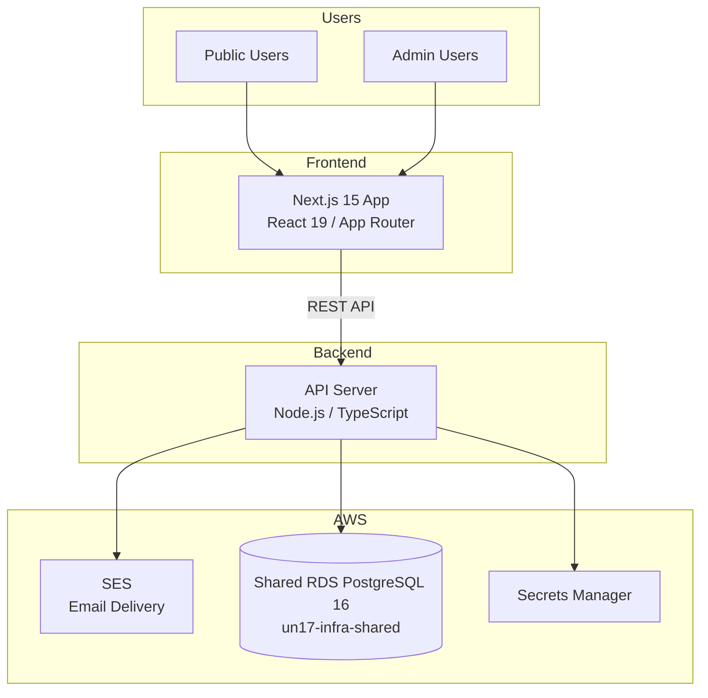
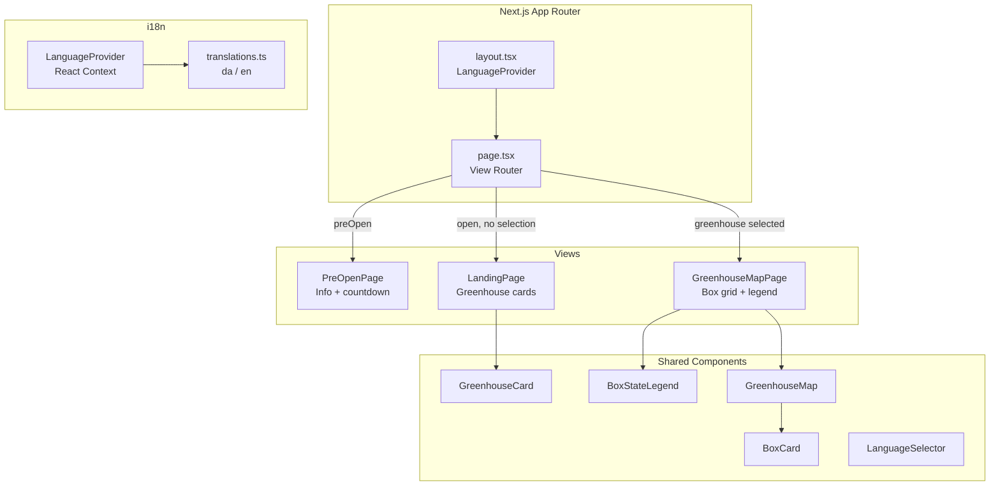
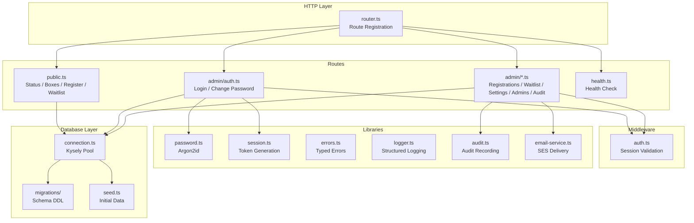
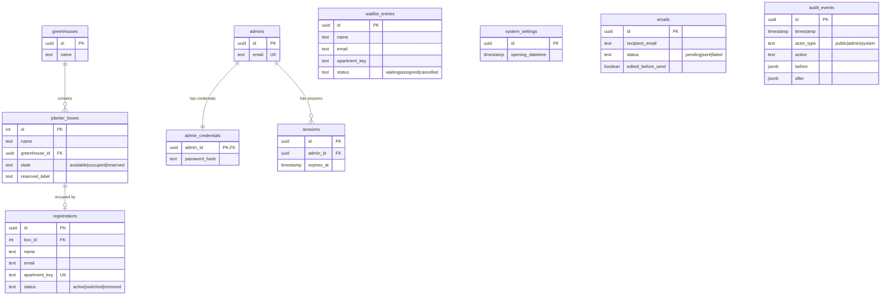
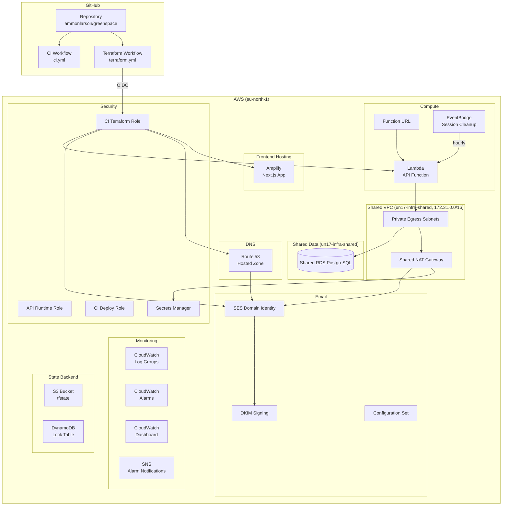
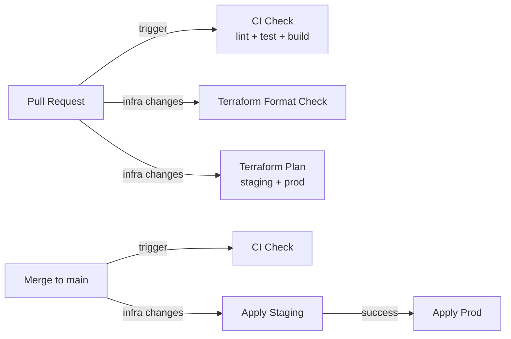

# UN17 Village Rooftop Gardens Architecture

## System Overview

UN17 Village Rooftop Gardens is a bilingual (Danish/English) registration platform that allows UN17 Village residents to register for rooftop planter boxes across two greenhouses. The system serves public users (no authentication) and admin users (email/password authentication).



## Frontend Architecture

The frontend is a Next.js 15 application using the App Router with React 19. It uses inline styles and a custom i18n system based on React context.



### View Routing

The app uses state-driven view switching (not URL routing):

1. **Pre-open mode** — When current time < opening datetime, show `PreOpenPage`.
2. **Landing** — After opening, show `LandingPage` with greenhouse summary cards.
3. **Map view** — When a greenhouse is selected, show `GreenhouseMapPage` with box grid.

### i18n

Language detection follows this priority:
1. Browser locale (`navigator.language`)
2. Manual user selection via `LanguageSelector`

The `LanguageProvider` React context makes the current language and `t()` translation function available to all components. Translation strings are defined in `translations.ts` with key contracts in `@greenspace/shared`.

## Backend Architecture

The API is a Node.js/TypeScript application using Kysely as a type-safe PostgreSQL query builder.



### API Surface

| Method | Path                          | Auth   | Description                        |
|--------|-------------------------------|--------|------------------------------------|
| GET    | `/public/status`              | None   | Registration open/closed status    |
| GET    | `/public/greenhouses`         | None   | Greenhouse summary counts          |
| GET    | `/public/boxes`               | None   | Public-safe box states             |
| POST   | `/public/register`            | None   | Register for a planter box         |
| POST   | `/public/waitlist`            | None   | Join waitlist                      |
| POST   | `/admin/auth/login`           | None   | Admin login                        |
| POST   | `/admin/auth/change-password` | Admin  | Change own password                |
| GET    | `/admin/registrations`        | Admin  | List all registrations             |
| POST   | `/admin/registrations`        | Admin  | Create override reservation        |
| POST   | `/admin/registrations/move`   | Admin  | Move registration between boxes    |
| POST   | `/admin/registrations/remove` | Admin  | Remove registration                |
| POST   | `/admin/waitlist/assign`      | Admin  | Assign waitlist entry to box       |
| PATCH  | `/admin/settings/opening-time`| Admin  | Update opening datetime            |
| POST   | `/admin/admins`               | Admin  | Create admin account               |
| DELETE | `/admin/admins/:id`           | Admin  | Delete admin account               |
| GET    | `/admin/audit`                | Admin  | Retrieve audit timeline            |
| GET    | `/health`                     | None   | Health check                       |

## Database Architecture

PostgreSQL 16 with 10 core tables. Schema is managed via Kysely migrations.



### Key Constraints

- **One active registration per apartment** — Partial unique index on `apartment_key` where `status = 'active'`.
- **One active occupant per box** — Partial unique index on `box_id` where `status = 'active'`.
- **Immutable audit trail** — Database trigger prevents UPDATE/DELETE on `audit_events`.
- **Box states** — Enum constraint: `available`, `occupied`, `reserved`.
- **FIFO waitlist** — Ordered by `created_at`; duplicate apartment preserves earliest timestamp.

## Infrastructure Architecture

All AWS infrastructure is managed via Terraform with isolated staging and production environments.



### Shared-VPC tenancy

Greenspace runs on the shared RDS instance owned by
`ammonl/un17-infra-shared`; the dedicated per-environment RDS stack was
decommissioned in #347 after the runtime cutover (#342 / #346). Because
greenspace has no dedicated database, the API Lambda itself now runs **inside
the shared default VPC** (172.31.0.0/16) rather than in a dedicated
per-environment VPC — the account-wide VPC consolidation (#471). The Lambda
attaches to the shared private egress subnets (published via the SSM tenancy
contract `/shared/network/vpc-id` and `/shared/network/private-subnet-ids`,
ammonl/un17-infra-shared#82) with its own egress-only security group in the
shared VPC:

- **Database:** the shared RDS lives in the same VPC, so the Lambda reaches it
  directly over the internal network — no peering hop. The shared RDS security
  group already admits the shared VPC CIDR.
- **SES and Secrets Manager:** reached over the shared NAT gateway. The
  dedicated VPC interface endpoints (≈$57/mo across both environments) are no
  longer created; tenants must not create endpoints in the shared VPC.

Immediately after the tenancy move, the dedicated VPCs (10.0.0.0/16 staging,
10.1.0.0/16 prod) stayed in place, dormant, as the rollback net. They were
destroyed once each environment validated (#472), and their configuration
removed outright in #501 — see [Dedicated VPC retirement](#dedicated-vpc-retirement)
below. `shared_vpc_id` and `shared_private_subnet_ids` are therefore **required**
module inputs: there is no dedicated VPC left to fall back to, so an environment
that omits them fails at plan time on variable validation.

See `docs/adr/0002-close-dedicated-vpc-rollback-path.md` for the decision that
closed the rollback path, `docs/adr/0001-shared-rds-connectivity.md` for the
superseded peering decision record, and
`docs/runbooks/shared-rds-migration.md` for the data-migration runbook used
during the RDS cutover.

Two external preconditions had to hold before the cutover apply — the
shared-db side owns both and neither is enforced by this module:

1. The SSM tenancy contract (`/shared/network/vpc-id`,
   `/shared/network/private-subnet-ids`) must already be published in each
   target account/region; otherwise `terraform plan` fails reading the data
   sources.
2. The shared RDS security group must admit the shared VPC CIDR, or DB
   connectivity is lost immediately post-apply with no plan-time signal.

### Dedicated VPC retirement

Once each environment's shared-tenancy move validated, its dedicated VPC was
destroyed (#472): the VPC itself, its subnets, route tables, internet gateway,
interface endpoints, dedicated-VPC security groups, and VPC flow logs. There is
no dedicated database to retire (greenspace has run on shared-db since #347), so
there was no soak period — each environment retired as soon as its move
validated.

The retirement was gated behind a `retire_dedicated_vpc` module input while it
was in flight, which left the destroyed resources declared at `count = 0` and
the rollback documented as supported. That rollback path is now **closed**
(#501, `docs/adr/0002-close-dedicated-vpc-rollback-path.md`): the gated
resources, `peering.tf`, the gate variable and its precondition, and the module
outputs describing the destroyed resources are all deleted. Reverting the gate
would only ever have built a *fresh* dedicated VPC with new ids and a new CIDR
rather than restoring the destroyed one, and the peering half could not have
worked at all once `un17-infra-shared` dropped its accepter-side grants
(ammonl/un17-infra-shared#93).

Undoing the shared-VPC move now means restoring the deleted resources from git
history and choosing fresh CIDRs — and, because the CI Terraform role is defined
by the stack it applies, granting the VPC-lifecycle permissions out of band
before the plan that reintroduces them can run (see the note in `iam.tf`). That
cost is accepted deliberately.

With the configuration gone, the CI Terraform role was pruned to match: its
`VPCNetworking` statement — 49 EC2 actions covering the VPC lifecycle, subnets,
gateways, endpoints, route tables, flow logs, and the whole peering set —
becomes `SharedVpcSecurityGroup`, holding only the security-group lifecycle, its
tags, and the four reads that resolve the Lambda's `vpc_config`. An allowlist
assert in `iam.tftest.hcl` (ported from `ammonl/un17-resources`) fails the build
if any other `ec2:` action is granted, including a bare `ec2:*`.

Remaining cleanup — the accepter-side `greenspace_peering` ingress and routes
on the shared-db side — is tracked as a follow-up in `un17-infra-shared`.

### Log encryption

CloudWatch log groups are encrypted at rest with an AWS-owned key: the module
sets no `kms_key_id`, which is CloudWatch's default.

Both environments previously used a per-stack customer-managed key,
`aws_kms_key.logs` (≈$1/mo each, for no benefit the default encryption doesn't
already provide). It is removed outright, along with its alias, key policy, and
module output.

**Applying that removal makes existing log history unreadable.** Events written
before the apply are encrypted under the key, and a key scheduled for deletion
enters `PendingDeletion` where it can no longer decrypt — so up to 90 days of
prod API logs and 14 days of staging are lost the moment the apply lands, not at
the end of the deletion window. This is an accepted cost. Staging and prod apply
independently (`terraform.yml` applies staging on merge, then prod once
`verify-staging` passes — automatically, with no approval step), so check which
have actually run before assuming either environment's history is gone.

There is a 30-day escape hatch, but it is **three steps, not two**. The same
apply destroys `aws_kms_key_policy.logs`, and destroying that resource resets
the key policy to the account default rather than deleting it — leaving a
root-only policy. Cancelling the deletion therefore produces an enabled key that
CloudWatch Logs still cannot use, for the same service-principal reason
described below. The policy must be restored as well:

```
aws kms cancel-key-deletion --key-id <key-arn>
aws kms enable-key          --key-id <key-arn>
aws kms put-key-policy      --key-id <key-arn> --policy-name default \
  --policy file://logs-key-policy.json
```

The policy needs to re-grant `logs.<region>.amazonaws.com` at least
`kms:Decrypt` and `kms:DescribeKey` under the original `ArnLike` condition on
`kms:EncryptionContext:aws:logs:arn`. The CI Terraform role holds none of
`kms:CancelKeyDeletion`, `kms:EnableKey`, or `kms:PutKeyPolicy`, so this needs
an admin principal. After the window closes the key is gone and so is the data.

Each of those applies also dropped a few seconds of log events: Terraform orders
the KMS destroys ahead of the in-place update that disassociates the log group,
so `PutLogEvents` was denied between the key-policy reset and
`DisassociateKmsKey`.

With the removal applied in both environments, the CI Terraform role's grants
that existed only to manage the key are gone as well — the key-lifecycle set,
`logs:AssociateKmsKey` / `logs:DisassociateKmsKey`, and both data-plane actions.
The role's entire remaining `kms:` surface is the bootstrap policy's
`Describe*`/`Get*`/`List*` plan-refresh reads.

`kms:Decrypt` went last, and only after checking what reads through it. The
environment roots read the shared-VPC tenancy contract from SSM on every plan,
which would have needed the grant had either parameter been a `SecureString`
under a customer-managed key. Neither is: `/shared/network/vpc-id` is a `String`
and `/shared/network/private-subnet-ids` a `StringList`, both with no `KeyId`.
Everything else the role touches sits under an AWS-owned or AWS-managed key —
the state bucket, the lock table, the log groups, the Lambda's environment
variables — and those need no IAM-side grant, because an AWS-managed key's own
policy admits same-account callers through `kms:ViaService`.

That last point cuts both ways, and there is a trap in it worth naming. Because
`alias/aws/ssm` grants decrypt through `kms:ViaService` with no IAM grant
required, dropping `kms:Decrypt` barely narrows what an over-broad SSM read would
expose: `ssm:GetParameter` with `WithDecryption` on `*` still returns every
`SecureString` under the default key, which is every `SecureString` not
explicitly given a customer-managed one. Only that CMK subset became unreadable.
The path scoping on the bootstrap policy's `SharedNetworkSsmRead` statement is
what prevents the rest, and it is load-bearing independently of any KMS grant.

`log_encryption.tftest.hcl` and `iam.tftest.hcl` hold the line across **all
three** of the role's inline policies, not one — IAM unions them, so a guard
reading a single document proves nothing about the role. Between them they cap
the granted `kms:`, `ec2:`, and `secretsmanager:` sets against explicit
allowlists, reject both `logs:` key-binding actions, and reject a bare `*` or
`service:*` that would confer any of the above without naming it. Rebuilding a
key means widening a guard deliberately.

The SNS alarm topic is left unencrypted at rest, and `alias/aws/sns` is
specifically not the fix. Per the [SNS key management
docs](https://docs.aws.amazon.com/sns/latest/dg/sns-key-management.html), an AWS
service event source can publish to an encrypted topic only through a
customer-managed key whose policy names that service principal, and the
AWS-managed key has no editable policy. CloudWatch alarms are this topic's only
publisher, so encrypting it that way would silently make every notification
undeliverable — the alarm still transitions, the publish just fails. The payload
is an alarm name, a metric, and a state, with no personal data, so that trade is
not worth making. The default topic policy (`AWS:SourceOwner` equal to the
account) already admits CloudWatch, so no compensating `aws_sns_topic_policy` is
needed.

Re-encrypting the topic later would require a customer-managed key with an
`Allow_CloudWatch_for_CMK` statement. Worth knowing: the key that was just
removed never granted `cloudwatch.amazonaws.com` either — only account root and
`logs.<region>.amazonaws.com`, and account-root delegation reaches IAM
principals, not service principals acting as themselves. Alarm delivery through
an encrypted topic has never worked here. It has never mattered, since
`enable_alarms` is `false` in both environments and no topic exists, but
`var.enable_alarms` defaults to `true` — so the first season alarms come back is
when it would first be noticed.

### Environments

| Environment | Domain                 | Runtime VPC               | Database                          |
|-------------|------------------------|----------------------------|-----------------------------------|
| staging     | `staging.un17hub.com`  | Shared (`172.31.0.0/16`)   | Shared RDS (`greenspace_staging`) |
| prod        | `un17hub.com`          | Shared (`172.31.0.0/16`)   | Shared RDS (`greenspace_prod`)    |

### Terraform Module Structure

```
infra/terraform/
├── bootstrap/                 One-time state backend setup
│   ├── main.tf
│   └── variables.tf
├── environments/
│   ├── staging/main.tf        Staging stack configuration
│   └── prod/main.tf           Production stack + subdomain delegation
└── modules/
    └── greenspace_stack/      Shared module for all AWS resources
        ├── main.tf            Naming prefix, provider config
        ├── amplify.tf         Amplify app, branch, and domain association
        ├── api_runtime.tf     Lambda function, Function URL, EventBridge schedule
        ├── dns.tf             No resources (zone + records owned by un17hub)
        ├── iam.tf             IAM roles and policies
        ├── monitoring.tf      CloudWatch, Alarms, Dashboard, SNS
        ├── networking.tf      Egress-only Lambda SG in the shared VPC
        ├── outputs.tf         Module outputs
        ├── ses.tf             SES configuration set (identity + DKIM owned by un17hub)
        ├── variables.tf       Input variables
        ├── iam.tftest.hcl     Least-privilege IAM validation tests
        └── iam_bootstrap.tftest.hcl  CI bootstrap policy drift guards
```

### CI/CD Pipeline



- **CI** runs on every PR: lint, test, build for all workspaces; `terraform fmt` + `terraform validate`.
- **Terraform** runs when `infra/terraform/**` changes: format check + plan on PRs, apply on merge to main. The `Format Check` job enforces `terraform fmt -check -recursive` and blocks merge when formatting is invalid.
- **Drift detection** runs daily via `drift-detection.yml`; creates a GitHub issue if drift is found.
- **Session cleanup** runs hourly via an EventBridge scheduled rule that invokes the API Lambda. The handler detects the scheduled event and deletes expired sessions (8-hour TTL) from the database.
- **Production apply** runs automatically after staging succeeds.
- **AWS auth** uses GitHub OIDC role assumption (no long-lived keys).

## Shared Package

The `@greenspace/shared` package contains code used by both frontend and backend:

- **Domain constants** — Greenhouse names, 29-box catalog, opening datetime, email config.
- **Types** — Interfaces for all entities (`PlanterBoxPublic`, `Registration`, etc.).
- **Validators** — Address, email, name validation with typed results.
- **DAWA** — Danish Address Web API types and helpers for address autocomplete.
- **i18n contracts** — Translation key definitions and language labels.
- **Enums** — Box states, registration statuses, audit actions.
